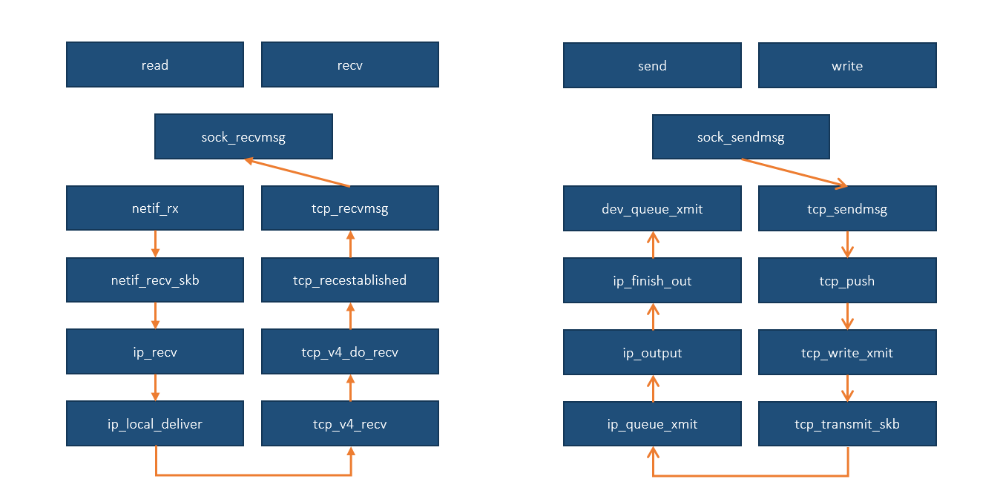

+++
title = "插件：net/tcpflow.py"
description = "TCP协议网络流量统计"
weight: 5
+++

## TCP协议网络流量统计

### 1. 指标解读 

此处流量指的是用户态程序发送和接收的数据大小。在Linux内核网络传输层提取TCP协议的流量，包括TCP发送数据包、接收数据包以及发送和接收数据包的流量总和。

### 2. 提取思路

从数据包收发流程中可以看到，`tcp_recvmsg()`和 `tcp_sendmsg()`是TCP协议接收和发送数据包的必经之路，TCP数据包接收和发送的函数执行流如下：



#### 2.1 TCP接收流量
利用 kprobe 挂接内核中的 `tcp_cleanup_rbuf` 函数，统计进程的接收实时流量。下行流量理应在数据包从用户态收包时的必经之路 `tcp_recvmsg()` 中进行统计，考虑到用户可能以非阻塞的方式就行读取数据，会面临着多次读取，才能够读取到数据，这样就面临这多次触发kretprobe。由于kretprobe的开销大于kprobe，所以对选取点进行改进，TCP接收的流量监控点从`tcp_recvmsg()`函数改为`tcp_cleanup_rbuf()`。

**函数流程：**

```c
tcp_recvmsg()
-->tcp_cleanup_rbuf();
```

如果通过`tcp_recvmsg()`成功接收到数据，在函数内部会调`tcp_cleanup_rbuf()`函数将用户接收到的数据从接收队列中清除。我们通过监控 `tcp_cleanup_rbuf()` 函数，统计size字段来实现统计TCP接收流量，`tcp_cleanup_rbuf()`在内核`net\ipv4\tcp.c`中：

```c
static void tcp_cleanup_rbuf(struct sock *sk, int copied)
```

可以看到它有两个参数：

- `struct sock *sk`表示接受数据对应的套接字
- `int copied`表示拷贝信息的字节数

第二个参数`copied`就是我们要统计TCP接收的流量信息。

#### 2.2 TCP发送流量
利用 kprobe 挂接内核中的 `tcp_sendmsg` 函数 ，统计进程的发送实时流量。统计的发送流量是数据包从用户态发包时的必经之路 `tcp_sendmsg()` 中，通过统计size字段来实现，`tcp_sendmsg()` 函数在内核`net\ipv4\tcp.c`中：

```c
int tcp_sendmsg(struct sock *sk, struct msghdr *msg, size_t size)
```

可以看到它有三个参数：

- `struct sock *sk`表示发送数据对应的套接字
- `struct msghdr *msg`表示发送的数据
- `size_t size`表示发送数据的大小

第三个参数`size_t size`就是我们要提取的TCP发送的流量信息。