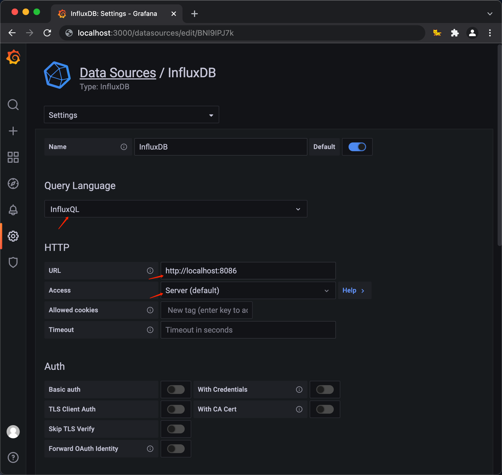
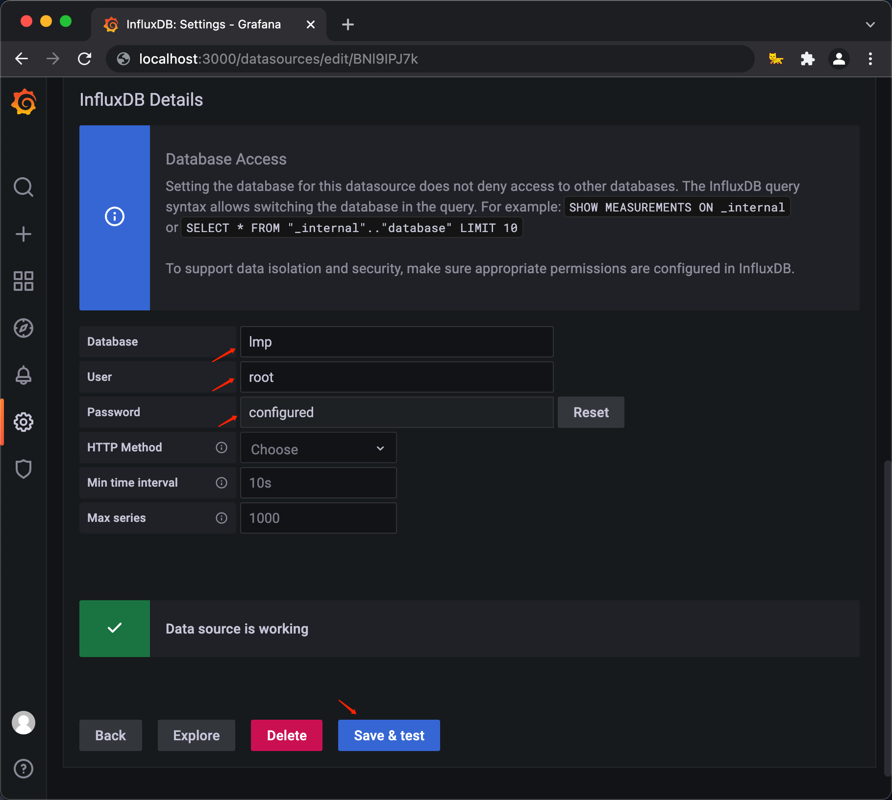
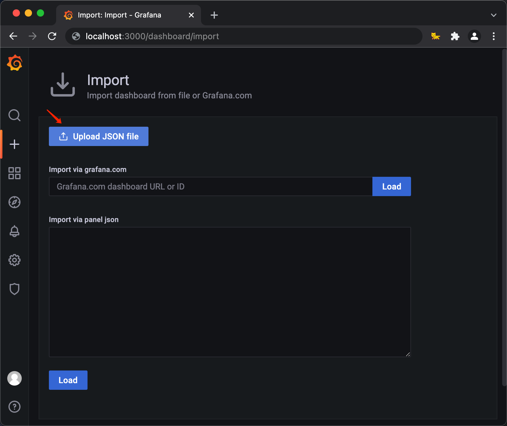
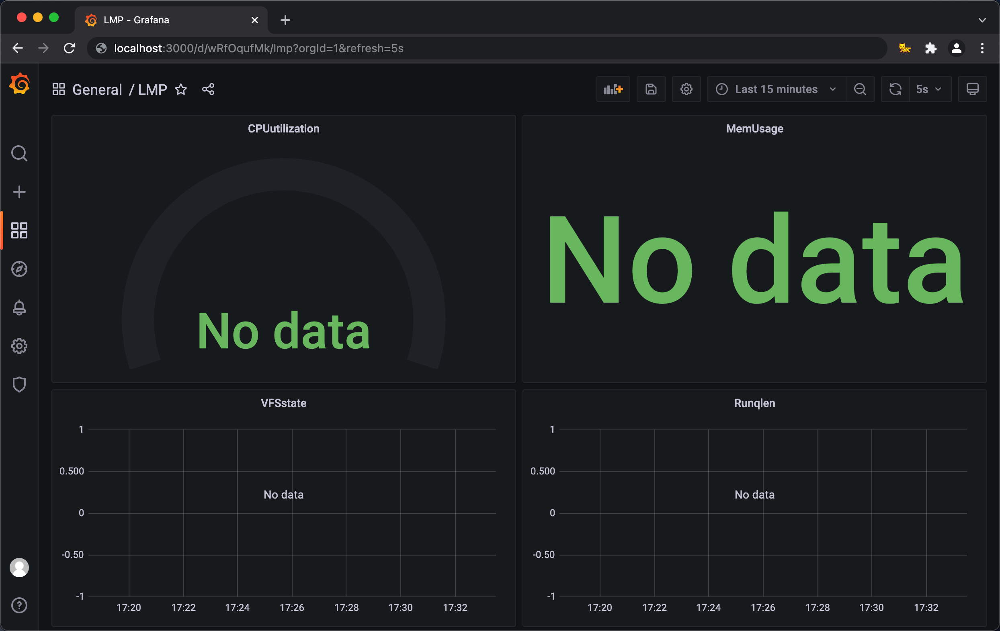

###   一、LMP安装部署

#### 1.拉取项目

```
git clone https://gitee.com/linuxkerneltravel/lmp.git
```

#### 2.修改配置文件（可选）

```
cd lmp #根据自己实际情况切换到lmp根目录
vim config/config.yaml
```
可根据自己的实际需要修改一些参数（如MySQL密码、端口等）
```
app:
  mode: "release"
  port: 8080 #LMP web服务端口
  machine_id: 1
  start_time: 2020-07-01

log:
  level: "debug"
  filename: "./lmp.log"
  max_size: 200
  max_backups: 7
  max_age: 67

mysql:
  host: "127.0.0.1" #MySQL服务器地址
  port: 3306 #端口
  user: "root" #用户名
  password: "123" #密码
  dbname: "lmp" #数据库名称
  max_open_conns: 200
  max_idle_conns: 50

influxdb:
  host: "127.0.0.1" #Influxdb服务器地址
  port: 8086 #端口
  user: "root" #用户名
  password: "123456" #密码
  dbname: "lmp" #数据库名称

plugin:
  path: "./plugins/"
  collecttime: 5

grafana:
  ip: "localhost:3000"
```

####  3.编译LMP并安装

```
cd lmp #根据自己实际情况切换到lmp根目录
sudo make db #导入MySQL数据库（在Enter password后面输入密码）
make #编译
```

#### 4.配置InfluxDB

```
#备份原配置文件和数据文件
sudo cp /etc/influxdb/influxdb.conf /etc/influxdb/influxdb.conf.bak 
sudo cp -r /var/lib/influxdb/data /var/lib/influxdb/data.bak
sudo cp -r /var/lib/influxdb/meta /var/lib/influxdb/meta.bak
sudo cp -r /var/lib/influxdb/wal /var/lib/influxdb/wal.bak
#替换为lmp配置文件
cd lmp #根据自己实际情况切换到lmp根目录
sudo cp test/influxdb_config/default.conf /etc/influxdb/influxdb.conf 
sudo cp -r test/influxdb_config/data /var/lib/influxdb
sudo cp -r test/influxdb_config/meta /var/lib/influxdb
#重新启动
sudo systemctl restart influxdb
----------------------------------
#若上述方式无法启动，可使用以下方式
sudo systemctl stop influxdb
sudo ./bin/influxd
```

#### 5.测试

```
cd lmp #根据自己实际情况切换到lmp根目录
./lmp
```


在浏览器内访问（localhost:8080需根据自己实际的网络环境替换）

```
http://localhost:8080
```


### 二、Grafana安装配置

#### 1.安装

```
#安装依赖
sudo apt install -y apt-transport-https software-properties-common wget
#添加grafana存储库
sudo wget -q -O - https://packages.grafana.com/gpg.key | sudo apt-key add -
echo "deb https://packages.grafana.com/oss/deb stable main" | sudo tee -a /etc/apt/sources.list.d/grafana.list
#更新缓存并安装
sudo apt update
sudo apt install grafana #此处会非常慢
#启动服务
sudo systemctl enable grafana-server
sudo systemctl start grafana-server
```

#### 2.配置

##### 数据源配置

在浏览器内访问（localhost:3000需根据自己实际的网络环境替换）

```
http://localhost:3000/login
```


默认的用户名和密码均为`admin`，登录后会提示修改密码，可以修改或选择skip跳过。（若搭建在公网环境建议修改为一定强度的密码）


登录到控制台页面后，在左侧选择Configuration>Data sources，并点击Add data source。


数据源类型选择InfluxDB。





进行详细的配置：

- Query Language：InfluxQL

- URL：http://localhost:8086 （需按自己实际的网络环境填写）

- Database：lmp

- User：root

- Password：123456 （默认为此）

点击**Save&test**按钮，显示`Data source is working`既为配置成功。

##### 导入预设控制台

在左侧选择Create>Import


点击Upload JSON file按钮，选择`lmp/test/grafana-JSON/lmp.json`导入。




出现下图所示控制台样式即为导入成功


