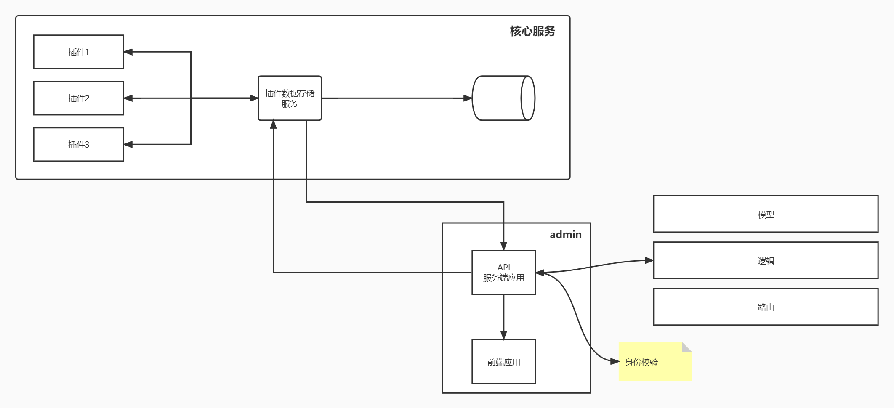

# 插件数据可视化部分thought log

#### 2022-04-08

今天开始使用thought log的形式记录项目方案的更迭。

LMP重构前的可视化方案采用的是集成现有的成熟组件，前端 + 后端 + mysql + influxdb + grafana，这样的方案在企业或者生产环境是比较适用的，但是对于个人用户来说，例如说自己的需求就是本地想要一个非常轻量化的ebpf插件可视化工具，不想安装配置mysql、influxdb、grafana这些组件。

目前的想法是LMP提供一个最简路径，就是我们提供一个最轻量化的web可视化方案，数据库采用一个内嵌数据库，然后把数据写入、获取这些留出接口，可以对接外部的数据库、可视化工具这些。

然后对目前的功能进行重新的梳理，LMP下会单独拆出来一个可视化项目，两个功能，一个是ebpf插件数据可视化，一个是场景化分析可视化，所以在这两部分的核心功能其实是数据的获取和存储，现在只考虑插件数据的可视化，一个草图：

插件可视化功能的核心服务是插件的数据存储，前端部分admin是和这个服务交互，`API服务端应用`负责解析前端参数，主要是解析出来需要执行哪个插件，然后将信息传递给`插件数据存储服务`，然后`插件数据存储服务`调用插件并执行，在插件执行后，`插件数据存储服务`会把插件的输出内容进行重定向，解析处理之后存储到内嵌数据库；

之后前端每过一段时间访问内嵌数据库的数据来进行数据可视化；

然后目前的想法是插件数据存储服务这一块其实是和`admin`部分隔离的，也就是离开`admin`其实是可以独立运行的，所以问题就是定义`插件数据存储服务`的功能范畴，目前看一个是负责插件的执行，因为需要重定向插件的输出，所以必须要由服务来启动插件，然后就是数据的存储；和外部的交互方式也是一个问题，就是`插件数据存储服务`和`API服务端应用`之间怎么交互比较好，（消息队列？），然后就是`API服务端应用`获取数据的时候，是直接和`插件数据存储服务`直接交互好，还是独立出来一个模块比如数据提取模块，和这个独立出来的模块交互比较好，最后就是这种设计有没有一些适用的设计模式或者架构上比较好的设计。

其实可视化部分的核心还是数据管理，data manager，可视化只是使用数据的一种方法，所以要有命令行执行查件并保存数据的功能，不通过web也可以保存数据；